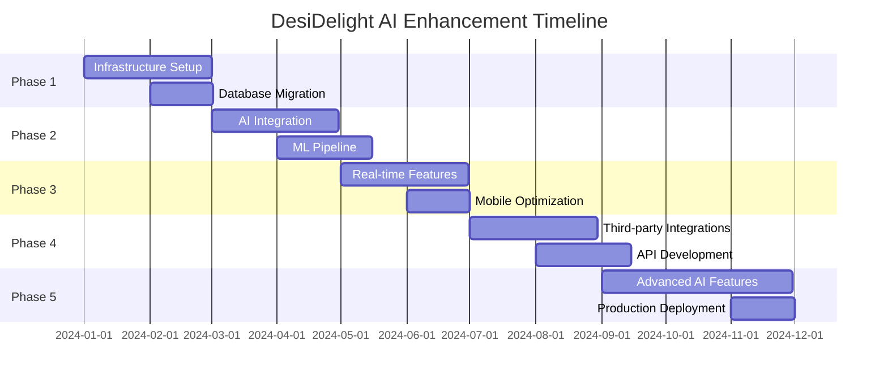

# DesiDelight Analytics - Scaling & AI Enhancement Roadmap

## Executive Summary

This document outlines a comprehensive strategy to scale the DesiDelight Analytics application and integrate modern AI capabilities to make it competitive in the current AI generation.

## Current State Assessment

### Strengths
- Clean React.js frontend with modern UI components
- Well-structured Flask backend with proper API design
- Comprehensive restaurant management features
- Good separation of concerns and modular architecture

### Limitations
- SQLite database (not production-ready)
- No AI/ML capabilities
- Limited real-time features
- Basic analytics without predictive insights
- No mobile optimization
- Limited integration capabilities

## Phase 1: Infrastructure Scaling (Months 1-2)

### 1.1 Database Migration & Optimization
```yaml
Current: SQLite
Target: PostgreSQL + Redis
Benefits:
  - ACID compliance for financial data
  - Better concurrent user handling
  - Advanced indexing for analytics
  - JSON support for flexible data structures
```

### 1.2 Containerization & Orchestration
```dockerfile
# Docker implementation
FROM python:3.11-slim
WORKDIR /app
COPY requirements.txt .
RUN pip install -r requirements.txt
COPY . .
EXPOSE 5000
CMD ["gunicorn", "--bind", "0.0.0.0:5000", "src.main:app"]
```

### 1.3 Microservices Architecture
```yaml
Services:
  - auth-service: Authentication & authorization
  - analytics-service: Data processing & ML
  - inventory-service: Inventory management
  - reporting-service: Report generation
  - notification-service: Real-time alerts
```

## Phase 2: AI/ML Integration (Months 3-4)

### 2.1 Predictive Analytics Engine
```python
# AI-powered features to implement:

1. Sales Forecasting
   - Time series analysis for demand prediction
   - Seasonal pattern recognition
   - Weather impact analysis
   - Event-driven demand spikes

2. Inventory Optimization
   - Smart reorder points
   - Waste reduction algorithms
   - Supplier performance analysis
   - Cost optimization recommendations

3. Customer Behavior Analysis
   - Customer segmentation
   - Purchase pattern recognition
   - Churn prediction
   - Personalized recommendations

4. Chef Performance AI
   - Skill gap analysis
   - Training recommendations
   - Performance benchmarking
   - Workload optimization
```

### 2.2 Natural Language Processing
```python
# NLP Features:
- Automated expense categorization
- Voice-to-text for order entry
- Sentiment analysis of customer feedback
- Smart search and filtering
- Automated report generation
```

### 2.3 Computer Vision Integration
```python
# CV Features:
- Receipt scanning and OCR
- Food quality monitoring
- Inventory counting automation
- Staff attendance tracking
- Safety compliance monitoring
```

## Phase 3: Real-time & Advanced Features (Months 5-6)

### 3.1 Real-time Analytics
```javascript
// WebSocket implementation for real-time updates
const socket = new WebSocket('ws://localhost:8000/analytics');
socket.onmessage = (event) => {
  const data = JSON.parse(event.data);
  updateDashboard(data);
};
```

### 3.2 Advanced Dashboard Features
```javascript
// AI-powered dashboard components:
- Predictive trend charts
- Anomaly detection alerts
- Smart recommendations panel
- Interactive data exploration
- Automated insights generation
```

### 3.3 Mobile-First Design
```css
/* Responsive design improvements */
@media (max-width: 768px) {
  .dashboard-grid {
    grid-template-columns: 1fr;
  }
}
```

## Phase 4: Integration & Ecosystem (Months 7-8)

### 4.1 Third-party Integrations
```yaml
Integrations:
  - POS Systems: Square, Toast, Clover
  - Accounting: QuickBooks, Xero
  - Payment: Stripe, PayPal
  - Delivery: Uber Eats, DoorDash
  - Social Media: Instagram, Facebook
  - Weather APIs: For demand prediction
```

### 4.2 API Marketplace
```python
# RESTful API with comprehensive endpoints
/api/v2/analytics/predictions
/api/v2/ai/recommendations
/api/v2/ml/forecasting
/api/v2/nlp/categorization
```

## Phase 5: Advanced AI Features (Months 9-12)

### 5.1 Machine Learning Pipeline
```python
# ML Pipeline Architecture:
1. Data Collection & Preprocessing
2. Feature Engineering
3. Model Training & Validation
4. Model Deployment & Monitoring
5. Continuous Learning & Improvement
```

### 5.2 AI-Powered Insights
```python
# Automated insights generation:
- "Sales increased 15% on weekends"
- "Chef John's dishes have 20% higher ratings"
- "Inventory waste reduced by 30% with new ordering"
- "Customer satisfaction improved 25% with menu changes"
```

### 5.3 Conversational AI
```python
# Chatbot integration:
- Natural language queries
- Voice commands
- Automated reporting
- Smart recommendations
- 24/7 customer support
```

## Technical Implementation Details

### 5.1 Technology Stack Enhancement
```yaml
Frontend:
  - React 18+ with Concurrent Features
  - TypeScript for type safety
  - React Query for data fetching
  - Zustand for state management
  - PWA capabilities

Backend:
  - FastAPI for better performance
  - Celery for background tasks
  - Redis for caching
  - PostgreSQL for primary data
  - Elasticsearch for search

AI/ML:
  - TensorFlow/PyTorch for deep learning
  - Scikit-learn for traditional ML
  - spaCy for NLP
  - OpenCV for computer vision
  - MLflow for model management
```

### 5.2 Data Architecture
```sql
-- Enhanced database schema
CREATE TABLE ml_predictions (
    id SERIAL PRIMARY KEY,
    model_name VARCHAR(100),
    prediction_type VARCHAR(50),
    input_data JSONB,
    output_data JSONB,
    confidence_score DECIMAL(5,4),
    created_at TIMESTAMP DEFAULT NOW()
);

CREATE TABLE ai_insights (
    id SERIAL PRIMARY KEY,
    insight_type VARCHAR(50),
    description TEXT,
    impact_score INTEGER,
    actionable BOOLEAN,
    created_at TIMESTAMP DEFAULT NOW()
);
```

### 5.3 Security Enhancements
```python
# Security improvements:
- JWT tokens with refresh mechanism
- Rate limiting and DDoS protection
- Data encryption at rest and in transit
- GDPR compliance features
- Audit logging and monitoring
- Multi-factor authentication
```

## Business Impact & ROI

### 5.1 Expected Benefits
```yaml
Operational Efficiency:
  - 40% reduction in manual data entry
  - 30% improvement in inventory accuracy
  - 25% reduction in food waste
  - 50% faster report generation

Revenue Growth:
  - 15% increase in sales through better forecasting
  - 20% improvement in customer satisfaction
  - 10% reduction in operational costs
  - 25% faster decision-making

Competitive Advantage:
  - First-mover advantage in AI-powered restaurant analytics
  - Differentiation through predictive capabilities
  - Scalable platform for franchise expansion
  - Data-driven competitive insights
```

### 5.2 Implementation Timeline


## Risk Mitigation

### 5.1 Technical Risks
```yaml
Data Quality:
  - Implement data validation pipelines
  - Regular data quality audits
  - Fallback mechanisms for ML predictions

Model Performance:
  - A/B testing for ML models
  - Continuous monitoring and retraining
  - Human oversight for critical decisions

Scalability:
  - Load testing and performance optimization
  - Auto-scaling infrastructure
  - Database sharding strategies
```

### 5.2 Business Risks
```yaml
Adoption:
  - User training and onboarding
  - Gradual feature rollout
  - Feedback collection and iteration

Competition:
  - Rapid development cycles
  - Unique feature differentiation
  - Strong customer relationships

Regulatory:
  - GDPR and data privacy compliance
  - Industry-specific regulations
  - Regular compliance audits
```

## Success Metrics

### 5.1 Technical Metrics
```yaml
Performance:
  - API response time < 200ms
  - 99.9% uptime
  - ML model accuracy > 85%
  - Real-time data latency < 1s

Scalability:
  - Support 1000+ concurrent users
  - Handle 1M+ daily transactions
  - Process 100GB+ data monthly
  - Auto-scale based on demand
```

### 5.2 Business Metrics
```yaml
User Engagement:
  - 80% daily active users
  - 5+ minutes average session time
  - 90% feature adoption rate
  - 4.5+ star user rating

Operational Impact:
  - 30% reduction in manual tasks
  - 25% improvement in decision speed
  - 20% increase in revenue per customer
  - 15% reduction in operational costs
```

## Conclusion

This roadmap provides a comprehensive path to transform DesiDelight Analytics into a cutting-edge, AI-powered restaurant management platform. The phased approach ensures manageable implementation while delivering immediate value and building toward long-term competitive advantage.

The key success factors are:
1. Strong technical foundation with scalable architecture
2. AI/ML integration that provides real business value
3. User-centric design with mobile-first approach
4. Continuous improvement and learning
5. Strong security and compliance framework

By following this roadmap, DesiDelight Analytics will be positioned as a leader in the AI-powered restaurant management space, providing unprecedented insights and automation capabilities to restaurant owners and operators. 